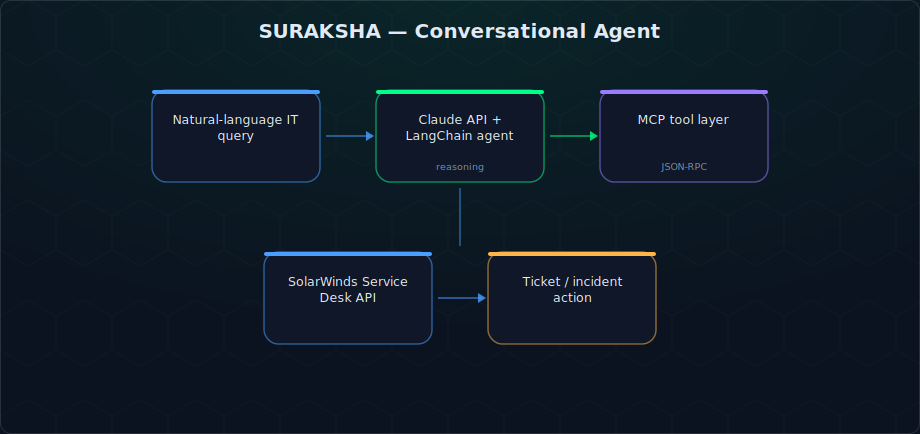
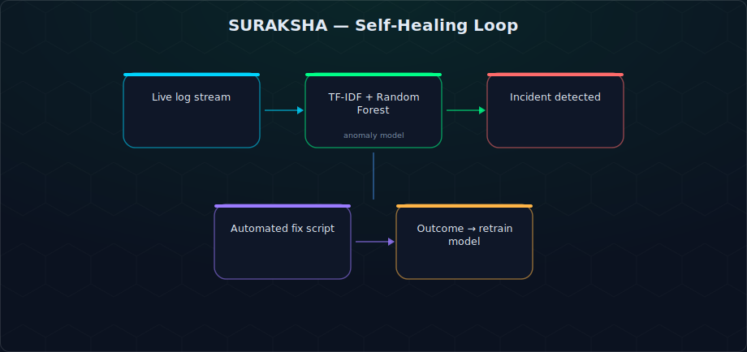
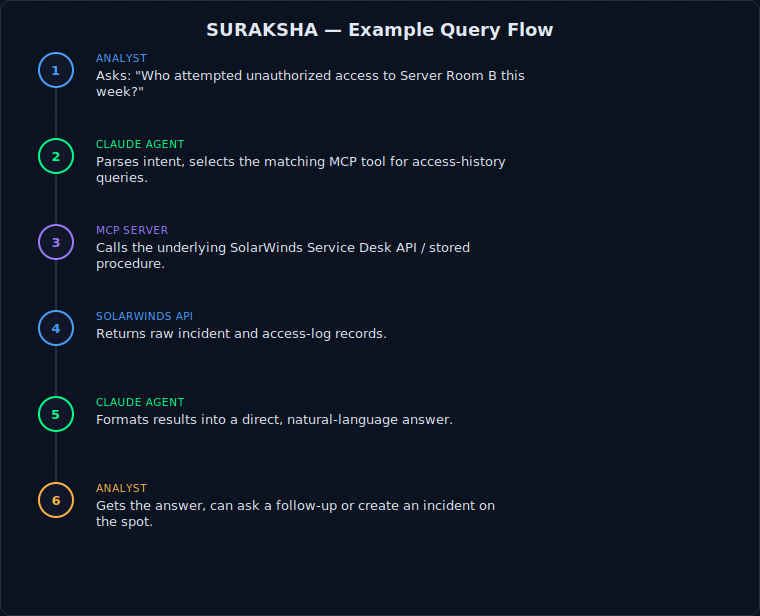

# SURAKSHA — AI-Driven IT Support & Self-Healing Automation


🏆 **2nd Place** — AIS National Competition 2025, University of Alabama
📄 **Published** — *SURAKSHA: AI-Driven IT Support and Automation*, International Scientific Studies Research Journal (ISSRJ), 2025 ([read the paper](https://www.issrj.org/wp-content/uploads/2025/12/SURAKSHA-AI-Driven-IT-Support-and-Automation.pdf))

A conversational IT service-desk agent that lets support staff query and act on **SolarWinds Service Desk** (Samanage) data in plain English, paired with a self-healing layer that watches infrastructure logs, classifies incidents, and applies fixes automatically.

## What it does

Instead of clicking through ticketing-system menus, an analyst can ask *"Who attempted unauthorized access this week?"* or *"Create an incident for the failed VPN gateway"* and get a structured answer or action back in seconds. Under the hood, an **MCP server** wraps the SolarWinds REST API as a set of typed, schema-validated tools; a **Claude- and LangChain-powered agent** decides which tools to call and how to phrase the result.

A second subsystem continuously tails operational logs, scores them with a lightweight ML model, and resolves recurring incidents on its own — learning from each validated fix.

### Conversational agent flow


### Self-healing loop


## Key features

- **MCP tool layer** over the SolarWinds Service Desk (Samanage) API — incidents, problems, changes, users, departments, groups, roles, and the knowledge base, each exposed as a discrete, typed tool
- **Claude-powered conversational client** that plans tool calls, maintains context, and supports prompt caching + batch processing for repeated queries
- **Web chatbot interface** (Flask) on top of the MCP server for non-technical users
- **Self-healing engine** — TF-IDF + Random Forest anomaly scoring over synthetic and live log streams, automated remediation scripts, and periodic model retraining from outcomes
- **Demo mode** with mock data, so the system can be evaluated without live SolarWinds credentials

## Reference


## User flow



## Tech


### Example interaction *(illustrative — not a captured live session)*

> **Analyst:** "Show me all unauthorized entry attempts to Server Room B this week, and create an incident for the most recent one."
>
> **SURAKSHA:** "Found 3 unauthorized attempts: Tue 9:14 AM (badge #4471, denied), Thu 2:03 PM (badge #2290, denied), Fri 11:47 PM (badge unknown, denied). Created Incident #INC-10432 for the Friday 11:47 PM attempt — flagged high priority due to after-hours timing."

## Real-world application

This follows the same natural-language-ops pattern showing up across enterprise ITSM (e.g., ServiceNow's Virtual Agent, Microsoft Copilot for Service) — letting support staff query and act on ticketing/access data conversationally instead of navigating multi-step UIs. Applying that pattern directly to SolarWinds via MCP is what made it a strong fit for the AIS competition: it's a real protocol (MCP) solving a real enterprise integration problem, not just a chatbot wrapper.

## Tech stack

`Python` · `Model Context Protocol (MCP)` · `Anthropic Claude API` · `LangChain` · `Flask` · `scikit-learn (Random Forest, TF-IDF)` · `SQLite` · `httpx`

## Repository structure

```
ai_driven_IT_support_system/
├── __main__.py                       # MCP server entry point (stdio transport)
├── enhanced_self_healing_system.py   # Log monitor + anomaly model + auto-remediation
├── solarwinds_mcp_server/
│   ├── server.py                     # FastMCP server, tool/resource definitions
│   ├── client.py                     # Direct API client
│   ├── conversational_client.py      # Claude-driven conversational agent
│   ├── app.py                        # Flask web chatbot
│   ├── static/ · templates/          # Chatbot UI assets
└── setup.py
```

## Setup

```bash
git clone https://github.com/ananthakrishna4747/ai_driven_IT_support_system.git
cd ai_driven_IT_support_system
uv venv && source .venv/bin/activate      # or: python -m venv .venv
uv pip install -e .
```

Create a `.env` with:
```
SOLARWINDS_API_TOKEN=your_api_token_here
SOLARWINDS_API_URL=https://api.samanage.com
ANTHROPIC_API_KEY=your_anthropic_api_key_here
```

Run the MCP server directly:
```bash
uv run python -m solarwinds_mcp_server
```

Or launch the full chatbot experience (MCP server + Flask UI):
```bash
python run_chatbot.py --host 0.0.0.0 --port 8080
```

To wire it into **Claude Desktop**, add to `claude_desktop_config.json`:
```json
{
  "mcpServers": {
    "solarwinds": {
      "command": "uv",
      "args": ["--directory", "/path/to/ai_driven_IT_support_system", "run", "python", "-m", "solarwinds_mcp_server"],
      "env": { "SOLARWINDS_API_TOKEN": "your_api_token_here" }
    }
  }
}
```

> No live token? The system runs in **demo mode** with simulated data when `SOLARWINDS_API_TOKEN` is left as the placeholder.

## Available MCP tools

| Category | Tools |
|---|---|
| Incidents | `create_incident`, `get_incident`, `update_incident`, `delete_incident`, `list_incidents`, `add_comment_to_incident` |
| Problems | `create_problem`, `get_problem`, `update_problem`, `delete_problem`, `list_problems`, `link_incidents_to_problem` |
| Changes | `create_change`, `get_change`, `update_change`, `delete_change`, `list_changes` |
| Users & orgs | `get_user`, `get_user_by_email`, `list_users`, `create_department`, `get/update/delete/list_department` |
| Knowledge base | `create_category` |
| Claude integration | `cache_prompt`, `list_cached_prompts`, `use_cached_prompt`, `batch_process_messages`, `analyze_with_claude` |

## Team & acknowledgments

Built for the **AIS National Competition 2025** by:
- **Anantha Krishna Chilappagari** — [LinkedIn](https://www.linkedin.com/in/anantha-krishna-ch/)
- **Nagarjuna Pendekanti** — [LinkedIn](https://www.linkedin.com/in/pendekanti/)
- **Teja Babu Mandaloju** — [LinkedIn](https://www.linkedin.com/in/teja-mandaloju/)
- **Sakeet Kopparapu** — [LinkedIn](https://www.linkedin.com/in/kopparapu-sakeet/)

With guidance from **Professor Sune Dueholm Müller**, University of Oslo, Department of Informatics.

## Roadmap

Concrete next steps for hardening this from hackathon project to production-style service:

- [ ] Docker Compose packaging for one-command local demo (MCP server + Flask UI + mock SolarWinds responses)
- [ ] Kubernetes deployment manifests so the MCP server can scale horizontally under concurrent agent sessions
- [ ] OAuth2 client-credentials flow for multi-tenant SolarWinds instances (currently single static API token)
- [ ] Vector store (FAISS/Pinecone) over historical tickets for semantic "find similar past incidents" search
- [ ] GitHub Actions CI running the existing Pytest suite on every PR

## License

No license file is currently included in this repository — treat as personal/educational project code.
